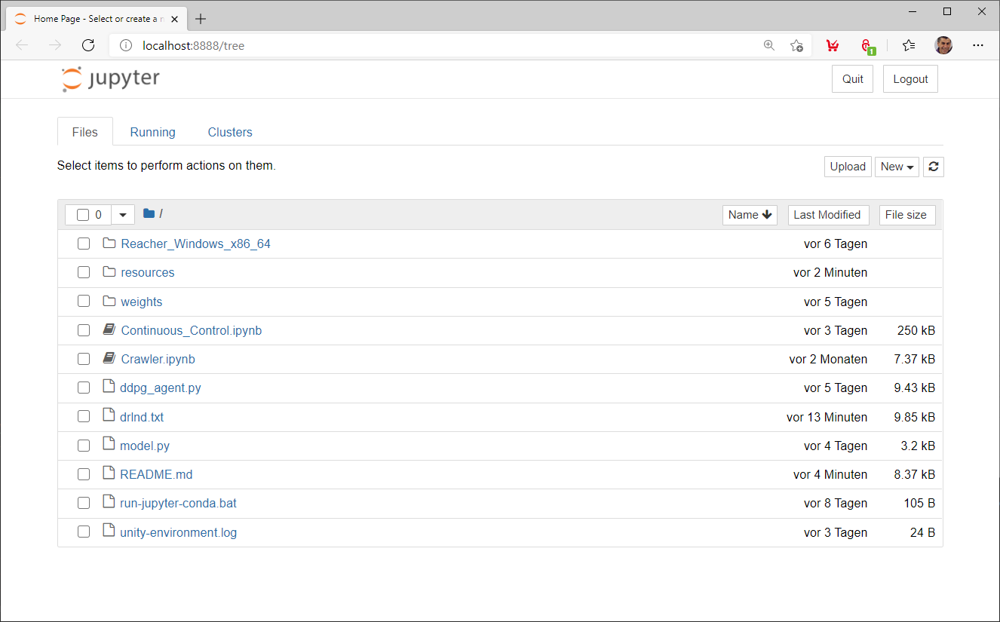
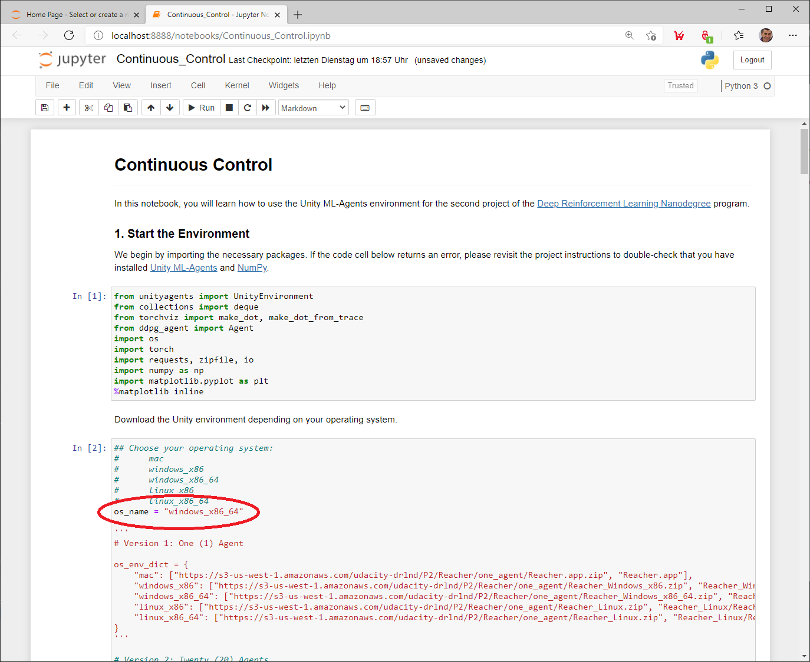

[//]: # (Image References)

[image1]: https://user-images.githubusercontent.com/10624937/43851024-320ba930-9aff-11e8-8493-ee547c6af349.gif "Trained Agent"


# Udacity Deep Reinforcement Learning Nanodegree - Project 2: Continuous Control

### Introduction

For this project, you will work with the [Reacher](https://github.com/Unity-Technologies/ml-agents/blob/master/docs/Learning-Environment-Examples.md#reacher) environment.

![Trained Agent][image1]

In this environment, a double-jointed arm can move to target locations. A reward of +0.1 is provided for each step that the agent's hand is in the goal location. Thus, the goal of your agent is to maintain its position at the target location for as many time steps as possible.

The observation space consists of 33 variables corresponding to position, rotation, velocity, and angular velocities of the arm. Each action is a vector with four numbers, corresponding to torque applicable to two joints. Every entry in the action vector should be a number between -1 and 1.

### Distributed Training

For this project, we will provide you with two separate versions of the Unity environment:
- The first version contains a single agent.
- The second version contains 20 identical agents, each with its own copy of the environment.  

The second version is useful for algorithms like [PPO](https://arxiv.org/pdf/1707.06347.pdf), [A3C](https://arxiv.org/pdf/1602.01783.pdf), and [D4PG](https://openreview.net/pdf?id=SyZipzbCb) that use multiple (non-interacting, parallel) copies of the same agent to distribute the task of gathering experience.  

### Solving the Environment

Note that your project submission need only solve one of the two versions of the environment. 

#### Option 1: Solve the First Version

The task is episodic, and in order to solve the environment,  your agent must get an average score of +30 over 100 consecutive episodes.

#### Option 2: Solve the Second Version

The barrier for solving the second version of the environment is slightly different, to take into account the presence of many agents.  In particular, your agents must get an average score of +30 (over 100 consecutive episodes, and over all agents).  Specifically,
- After each episode, we add up the rewards that each agent received (without discounting), to get a score for each agent.  This yields 20 (potentially different) scores.  We then take the average of these 20 scores. 
- This yields an **average score** for each episode (where the average is over all 20 agents).

The environment is considered solved, when the average (over **100** episodes) of those average scores is at least **+30**. 


[//]: # (Image References)

[image1]: https://user-images.githubusercontent.com/10624937/42135619-d90f2f28-7d12-11e8-8823-82b970a54d7e.gif "Trained Agent"


## Files included in this repository

The code used to create, train and evaluate the agent:

|File                                                         |Description                                                        |
|:------------------------------------------------------------|:------------------------------------------------------------------|
|[Continuous_Control.ipynb](Continuous_Control.ipynb)         |Jupyter notebook to train and evaluate the agent                   |
|[ddpg_agent.py](ddpg_agent.py)                               |Implementation of the DDPG agent                                    |
|[model.py](model.py)                                         |Network architecture used by the DDPG agent                         |
|[drlnd.txt](drlnd.txt)                                       |Conda environment file                                             |

Documentation:

|File                                                         |Description                                                        |
|:------------------------------------------------------------|:------------------------------------------------------------------|
|[Report.md](Report.md)                                       |Description of the development process and the learning algorithm  |
|README.md                                                    |This README.md file                                                |

The trained models:

|File                                               |Description                         |
|:--------------------------------------------------|:-----------------------------------|
|weights/checkpoint_actor.pth                       |Weights of the Actor Network        |
|weights/checkpoint_critic.pth                      |Weights of the Critic Network       |


## Environment Setup

This section describes how to get the code for this project and how to set up the environment.

### Getting the code

First create a project directory and change to this directory.

Run the following command to clone this repository using GIT

```
$ git clone https://github.com/aboerzel/udacity-deep-reinforcement-learning-p2-continuous-control.git
```

### Create the environment
The `drlnd.txt` file included in this repository describes all the packages required to set up a [Conda](https://docs.conda.io/projects/conda/en/latest/index.html) environment.
If you haven't installed Conda, download the [Conda installer](https://www.anaconda.com/distribution/) and follow the [installation instructions](https://docs.anaconda.com/anaconda/install/).

Run the following commands to create the environment, this will create an environment named `drlnd`.

```
$ conda create --name drlnd --file drlnd.txt
$ conda activate drlnd  
```

## Train and evaluate the Agent

Activate the `drlnd` environment and start the Jupyter Notebook server by running the commands below. A new browser tab will open with a list of the files in the current folder.

```
$ conda activate drlnd
$ jupyter notebook
```

Click on the [Continuous_Control.ipynb](Continuous_Control.ipynb) notebook to open it.  

  

First set the variable `os_name` according to your operating system before you run the notebook cells so that the appropriate Unity environment will be downloaded.

Available options:

* mac (Mac OSX)
* windows_x86 (Windows 32-bit)
* windows_x86_64 (Windows 64-bit)
* linux_x86 (Linux 32-bit)
* linux_x86_64 (Linux 64-bit) 



Then execute the notebook cells one after the other with the key combination **SHIFT + ENTER**, starting with cell **1**.

In order to evaluate the agents only with the pre-trained weights, the cells for the training can be skipped. 
The cells for visualizing the network architecture can also be skipped. 
Corresponding information can be found in the comments in the Jupiter Notebook.

### Hyperparameters
The learning process can be influenced by changing the following parameters:  

In the [Continuous_Control.ipynb](Continuous_Control.ipynb) file:  

|Parameter         |Description|
|:-----------------|:----------|
|n_episodes        |Maximum number of training episodes|
|max_t             |Maximum number of timesteps per episode|
|print_every       |Number of episodes for calculating the average score value (sliding window)|

In the [ddpg_agent.py](ddpg_agent.py) file:

|Parameter                 |Description|
|:-------------------------|:----------|
|BUFFER_SIZE               |Replay buffer size|
|BATCH_SIZE                |Batch size|
|GAMMA                     |Discount factor for expected rewards|
|TAU                       |Multiplicative factor for updating the target network weights|
|LR_ACTOR                  |Learning rate of the actor network|
|LR_CRITIC                 |Learning rate of the critic network|
|WEIGHT_DECAY              |L2 weight decay|
