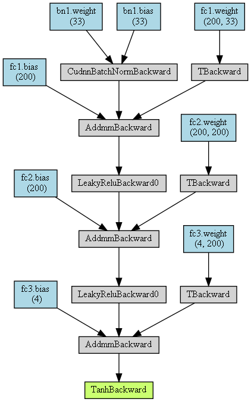
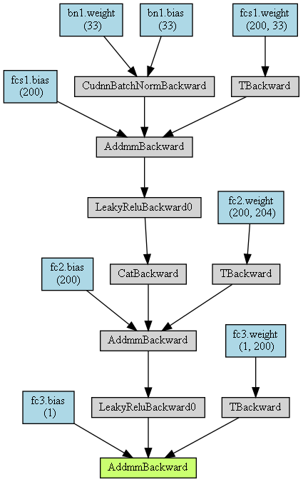
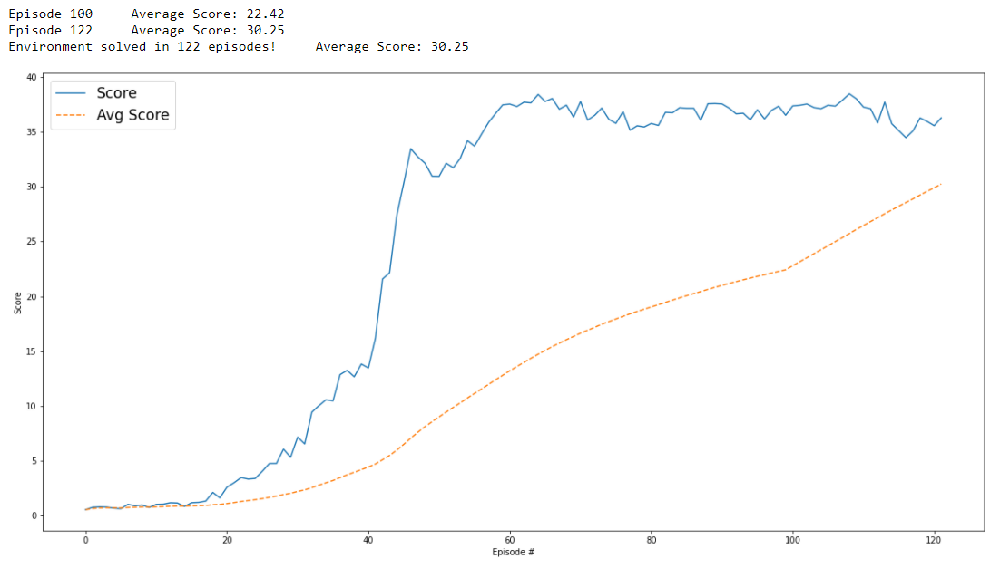
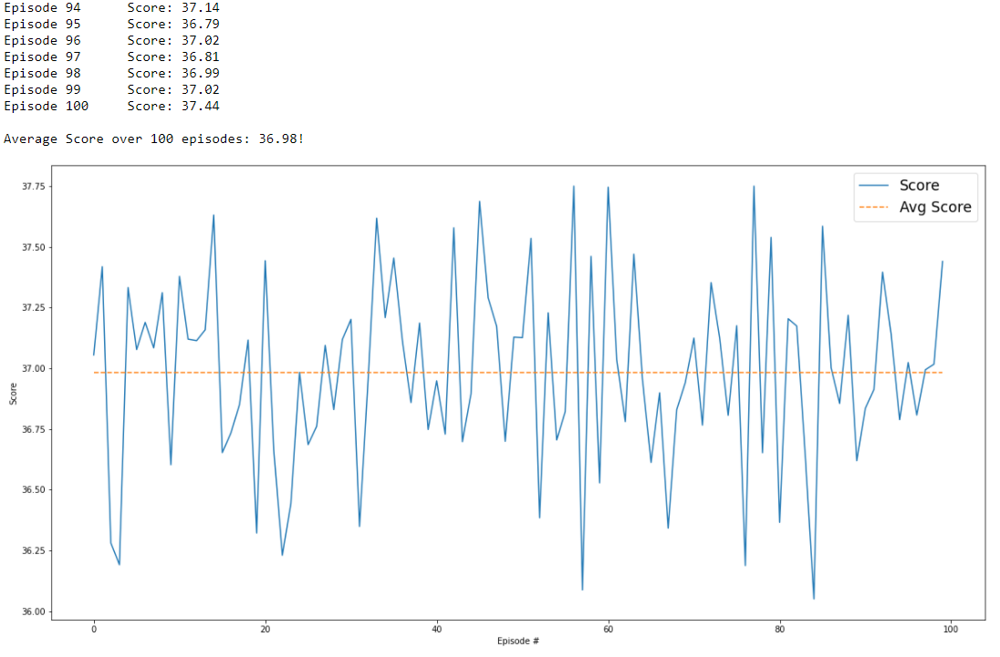

# Udacity Deep Reinforcement Learning Nanodegree - Project 2: Continuous Control

## Description of the implementation

### Algorithm
In this project I examined the 4 deep reinforcement learning algorithms from lesson 2 "Deep Q-Networks":

* [DDPG-Paper](https://arxiv.org/pdf/1509.02971.pdf)
* [Experience Replay](https://paperswithcode.com/method/experience-replay)
 
OUNoise (Ornstein-Uhlenbeck)
Replay Buffer

- Code-Beispiel adaptiert
- Netzwerkarchitektur angepasst 
- Multi-Agent 
- OUNoise
- Batch Normalization 
- Hyperparameter BATCH_SIZE

##### Actor Network Architecture
I started with the Deep Q-Network (DQN) algorithm using the following Q-Network architecture:  

- Input layer with 33 nodes for the states (position, rotation, velocity, and angular velocities of the arm)
- Batch Normalization layer 
- First Fully-Connected layer with 200 nodes
- Second Fully-Connected layer with 200 nodes
- Output layer with 4 nodes for the possible actions (rotation angles of the two joints)

leaky_relu(self.fc1(x))
torch.tanh(self.fc3(x))

 

##### Critic Network Architecture
Next I implemented the Dueling Double Deep Q-Network algorithm, which required an expansion of the network architecture:

- Input layer with 33 nodes for the states (position, rotation, velocity, and angular velocities of the arm)
- Batch Normalization layer 
- First Fully-Connected layer with 200 nodes
- Second Fully-Connected layer with 200 nodes
- Output layer with 1 node for the Q-value

leaky_relu(self.fc1(x))

  

## Training & Evaluation

I trained the DDPG-Agent until they got an average score of **+13** in the last **100** consecutive episodes. 
I have also adjusted the hyperparameters to get the best training results.

### Hyperparameters
The learning process can be influenced by changing the following parameters:  

Parameters for controlling the training length in the [Continuous_Control.ipynb](Continuous_Control.ipynb) file:  

|Parameter         |Value |Description|
|:-----------------|-----:|:----------|
|n_episodes        | 10000|Maximum number of training episodes|
|max_t             |  1000|Maximum number of timesteps per episode|
|print_every       |   100|Number of episodes for calculating the average score value (sliding window)|

DDPG-Agent parameters in the [ddpg_agent.py](ddpg_agent.py) file:

|Parameter                 |Value     |Description|
|:-------------------------|---------:|:----------|
|BUFFER_SIZE               |       1e5|Replay buffer size|
|BATCH_SIZE                |       256|Batch size|
|GAMMA                     |      0.99|Discount factor for expected rewards|
|TAU                       |      1e-3|Multiplicative factor for updating the target network weights|
|LR_ACTOR                  |      1e-4|Learning rate of the actor network|
|LR_CRITIC                 |      1e-3|Learning rate of the critic network|
|WEIGHT_DECAY              |         0|L2 weight decay|

### Plot of Rewards
This graph shows the rewards per episode within the training phase of the DDPG-Agent, as well as the moving mean.  
It illustrates that the Agent was trained until an average reward of at least **+30** over **100** episodes was reached.   

In this case, the Agent solved the environment after **122 episodes**.

### Evaluation result 
This graph shows the rewards per episode within the evaluation of the DDPG-Agent over 100 episodes and the average score.
It illustrates that the Agent is able to receive an average reward of about **+36.98** over **100** episodes.

## Ideas for Future Work

1. Further hyperparameter tuning may produce better results. 
   

2. The agent's training was stopped here when the target score of +30 was reached. The agents could be trained until there is no longer any significant improvement in the score, so higher score values could be achieved.  

3. Agents with other combinations of the different algorithms could achieve better results, e.g. Double DQN with Prioritized Experience Replay.

4. Use of other network architectures, e.g. more hidden layers or more or fewer nodes per layer.

